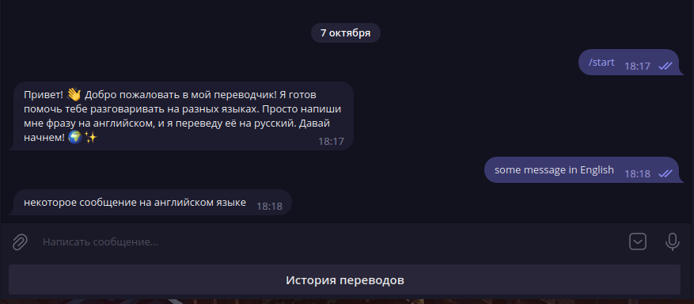
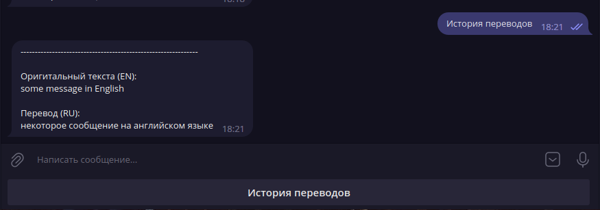

# Translation Bot

Translation Bot: Бот для мгновенного перевода текста с английского на русский на основе [DeepL](https://www.deepl.com).

## Запуск

Для запуска бота необходимо:

- Скачать и установить [Docker](https://docs.docker.com/engine/install/); 
- Установить [Docker Compose](https://docs.docker.com/compose/install/); 
- Указать необходимую информацию в файле docker-compose.yaml; 
- Перейти в директорию с файлом docker-compose.yaml; 
- Запустить бот с выводом логов в терминал:

```
docker compose up
```

Или запустить без вывода логов в терминал:

```
docker compose up -d
```

## Использование

### Перевод

Перейдите в бота, нажмите кнопку `Старт`, и затем, после приветственного сообщения, отправьте текст, который вы хотите перевести.



### История

Чтобы получить историю всех своих переводов, нажмите на кнопку `История переводов`.



## Тестирование

### Важно!
Перед выполнением тестов убедитесь, что у вас установлена версия [Python 3.11](https://www.linuxcapable.com/how-to-install-python-3-11-on-ubuntu-linux/) и утилита pip. 
В случае отсутствия pip выполните следующую команду: `sudo apt install python3-pip`

1. Скачайте и установите [Poetry](https://python-poetry.org/docs/);
2. Создайте виртуальное окружение:

```
python3.11 -m poetry env use python3.11
```

3. Установите все зависимости:

```
python3.11 -m poetry install
```

4. Активируйте виртуальное окружение:

```
source <путь до файла>
```

5. Запустите тесты:

```
pytest tests
```
